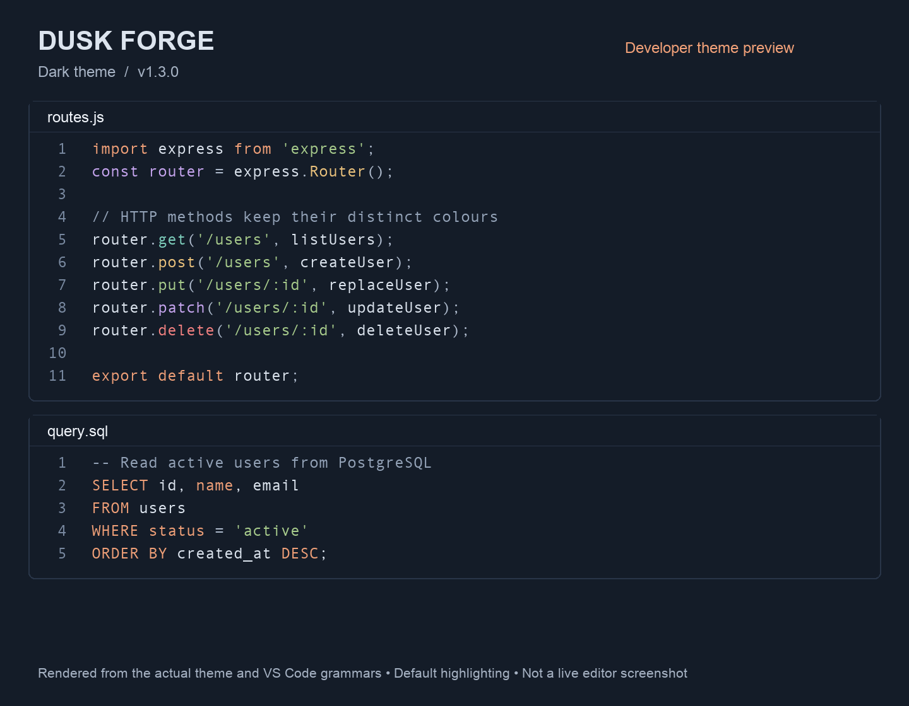
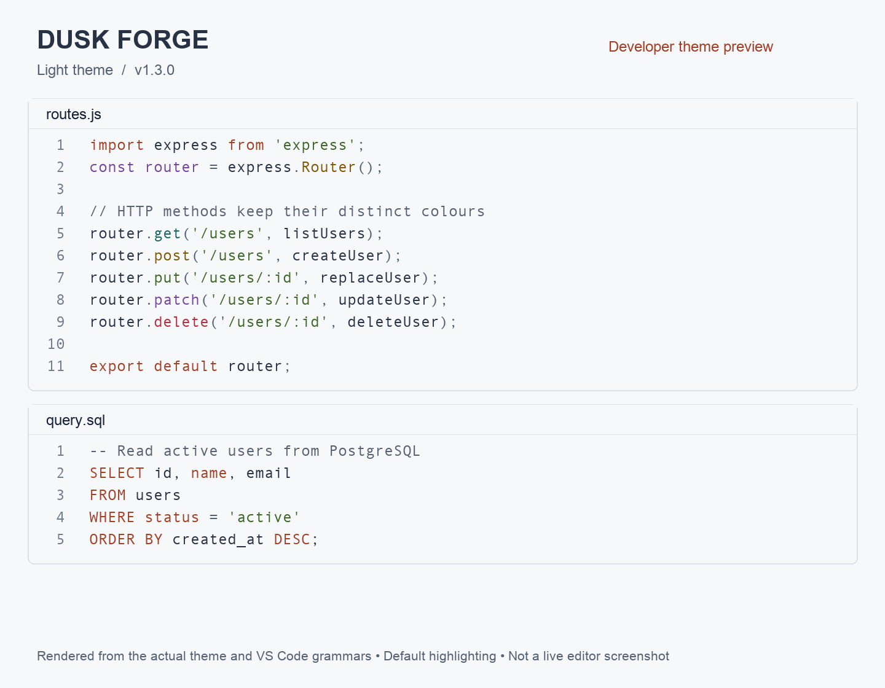

# Dusk Forge

Two coordinated VS Code themes for developers: **Dusk Forge Dark** and **Dusk Forge Light**.

Dark uses deep slate surfaces with warm amber, teal, blue and lavender syntax. Light uses soft off-white surfaces with darker ink colours, rather than simply inverting the dark palette.

## MERN, MEAN and PostgreSQL

- **React / Next.js:** component types, props, hooks, strings and control flow use consistent colour roles.
- **Angular:** TypeScript decorators, classes, properties and HTML attributes have distinct colours. Angular-specific template syntax relies on the Angular language extension.
- **Express / Node.js:** HTTP method scopes are preserved alongside regular JavaScript and TypeScript highlighting.
- **MongoDB:** JSON document keys and JavaScript object properties use blue, separate from green string values and purple constants. This release does not parse MongoDB queries or assign special colours to individual aggregation operators.
- **SQL / PostgreSQL:** explicit rules cover statement keywords, SQL types, constraints, functions and parameter scopes. PostgreSQL dollar-quoted strings are covered when the installed grammar exposes those scopes.

A theme styles scopes supplied by VS Code and language extensions; it does not install a database client or language server. SQL inside JavaScript strings remains string-coloured unless another extension provides embedded SQL scopes.

## Install and select

Search for **Dusk Forge** by **Yasowant Nayak**, or run:

```
ext install yasowant.ember-dusk-yasowant
```

Open **Preferences: Color Theme** and select **Dusk Forge Dark** or **Dusk Forge Light**. Existing users of the Dusk Forge theme retain the dark theme through its stable theme ID.

## Built for reading code

- Distinct colours for keywords, strings, functions, types, properties and constants.
- Readable comments, restrained surfaces, visible keyboard focus and active tabs.
- Search match borders, selection overlays, bracket colours and inlay hints.
- Coordinated Git decorations, diffs, diagnostics, terminal colours and autocomplete menus.
- TextMate syntax highlighting by default, with optional semantic colour definitions for supported language extensions.

All configured syntax and semantic foreground colours meet a measured contrast ratio of at least 4.5:1 against their base editor background. This does not certify every UI state or colour-vision accessibility. Highlighting also depends on the language extension and user overrides.

## HTTP methods

The included grammar injections assign distinct scopes to supported HTTP patterns:

| Method | Colour family |
| --- | --- |
| GET | Teal |
| POST | Amber |
| PUT | Green |
| PATCH | Purple |
| DELETE | Red |

Supported patterns include common router calls, fetch method strings, axios calls, Next.js route handlers and `.http` files. The method names remain visible, so colour is an additional cue. Both themes default to grammar highlighting so generic language-server method colours do not overwrite these distinct HTTP colours.

React hook, Next.js API and `use client` / `use server` scopes are preserved from the previous release.

## Palette

| Role | Dark | Light |
| --- | --- | --- |
| Editor | `#141C28` | `#F7F8FA` |
| Text | `#DCE4EE` | `#273344` |
| Comments | `#94A3B8` | `#566273` |
| Keywords | `#F0A078` | `#A33F26` |
| Functions | `#EBC27C` | `#805700` |
| Strings | `#A8CC8C` | `#3C6527` |
| Types | `#7DCDBB` | `#14685E` |
| Document keys / attributes | `#8FBDF2` | `#225EA2` |
| Constants | `#C6A5EF` | `#7444A0` |

## Feedback

[Report an issue](https://github.com/Yasowant/my-extension/issues) with your language, a small code example and the highlighting you expected.

## License

MIT

## HTTP colours troubleshooting

Version 1.2.2 fixes the default semantic overlay that made HTTP methods share the same function colour. After updating, run **Developer: Reload Window** and select **Dusk Forge Dark** or **Dusk Forge Light**.

If your user or workspace settings explicitly force semantic highlighting on, use this theme-specific setting in your VS Code settings JSON:

```json
"editor.semanticTokenColorCustomizations": {
  "[Dusk Forge Dark]": { "enabled": false },
  "[Dusk Forge Light]": { "enabled": false }
}
```

Merge these entries into any existing setting rather than replacing your other customizations. Semantic highlighting is optional: turning it on can override the method-specific grammar colours. This does not disable IntelliSense, type checking or diagnostics.

## Version 1.3.0 developer improvements

- Safer HTTP matching: ordinary `cache.get('/users')`, `Map.get()` and `.delete()` are no longer treated as HTTP based only on a slash-prefixed argument.
- Known HTTP receivers (such as `router`, `app`, `axios`, `apiClient`) and `router.route('/users').get(...).post(...)` chains have method-specific colours. Multiline call arguments are covered. Arbitrary aliases are intentionally not guessed; HTTP matching is a grammar heuristic, not type analysis.
- React component tokens stay teal, props blue and hooks distinct. Angular decorator names use purple, separate from blue attributes; Angular template intelligence still requires Angular Language Service.
- Debug stack-frame, exception, merge-conflict and diff borders now have explicit colours.
- Restrained highlight overlays preserve syntax contrast in selected, searched and changed code. Light comments are darker for readability.

### Previews

These are rendered examples from the actual theme and VS Code grammars, not live editor screenshots. Your font, settings and installed language extensions may change the appearance.




### Try the sample workspace

Open [examples](https://github.com/Yasowant/my-extension/tree/main/examples) in VS Code to compare Express routes, React, Angular, MongoDB-style JSON and PostgreSQL. The examples are highlighting fixtures, not a bundled runnable application. No database or secrets are required.

### Test and report issues

Run `npm ci` and `npm test`; see [test instructions](tests/README.md) for grammar locations. The automated suite covers real VS Code grammars and contrast over editor overlays. It does not certify every UI combination or replace real-project testing.

For a useful report include your VS Code/extension version, language mode, active theme, minimal code sample and output from **Developer: Inspect Editor Tokens and Scopes**. Check user/workspace token overrides before reporting. Never include credentials.

## Developer toolkit (1.4.0)

Open the Command Palette and type **Dusk Forge**:

- **Check Highlighting**: read the active theme, language mode and highlighting settings, then show troubleshooting guidance. No settings are changed.
- **Developer Setup**: guidance for built-in JavaScript/TypeScript support, ESLint, Angular, SQL and snippets. Extension links open their details page; nothing is installed automatically.
- **Current File Problems**: list existing errors and warnings from installed language tools, navigate to one, and open the normal Quick Fix picker. No fixes are automatically applied.
- **Show Quick Fixes**: show available fixes at the cursor for you to review.
- **Open Problems Panel**: open VS Code's workspace Problems view.

Snippets: type `df` and trigger suggestions, or use **Snippets: Insert Snippet**.

| Prefix | File type | Starting point |
| --- | --- | --- |
| dfroute | JS / TS | Express async route with error forwarding |
| dffetch | JS / TS | JSON fetch helper with HTTP status check |
| dfquery | JS / TS | Parameterized node-postgres query |
| dfreact | JSX | React component |
| dfreactts | TSX | Typed React component |
| dfselect | SQL | SELECT with filter, ordering and limit |
| dftransaction | SQL | Transaction skeleton ending in ROLLBACK |

Review snippet placeholders and adapt them to your project. The query snippet requires an existing database client and async context. Snippets do not install libraries or execute queries.

The toolkit runs only when its commands are invoked. It has no network requests, telemetry, database access or background project scanning. Diagnostics and fixes come from installed language tools; Dusk Forge does not independently discover application bugs. A clean Problems list is not proof that code is correct.
